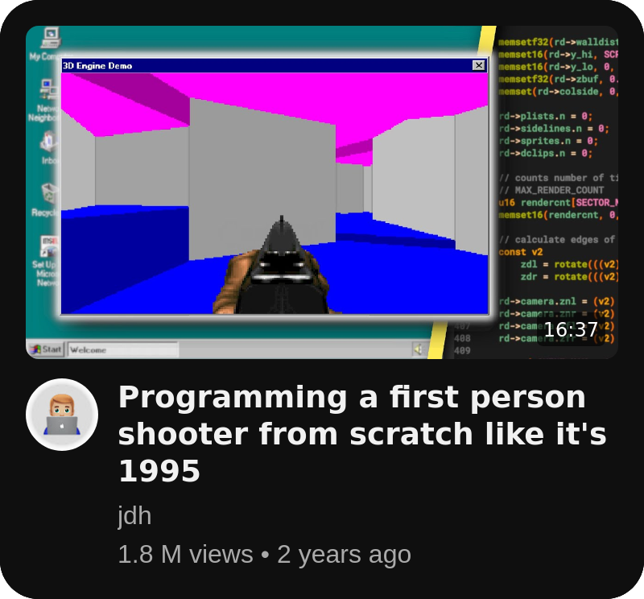
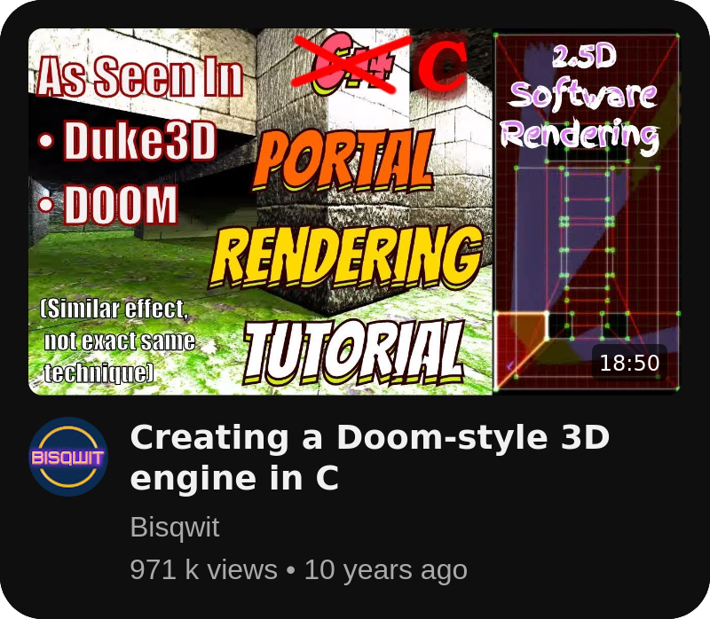
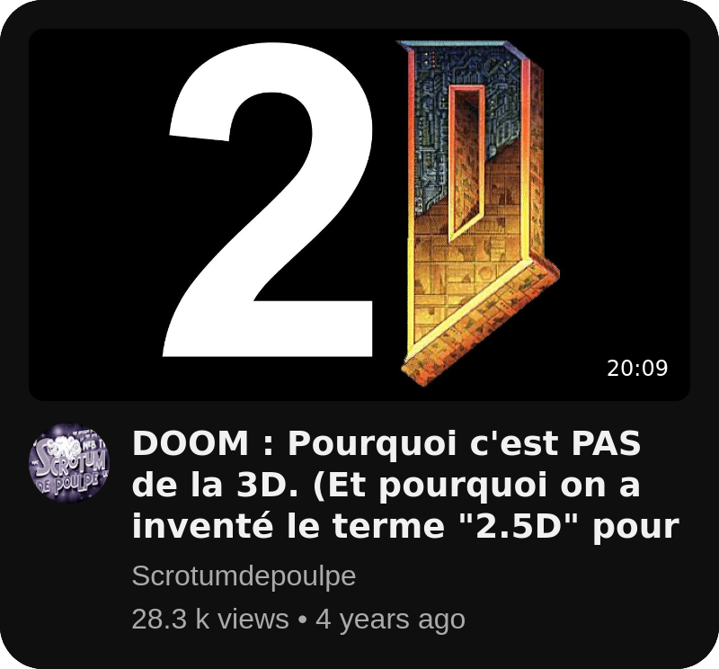

<div align="center">
	
</div>

## Build

### Mandatory

```sh
make
```

## Allowed functions

> open, close, read, write,
> printf, malloc, free, perror,
> strerror, exit, gettimeofday

As well as:

-   All functions of the math library (-lm man man 3 math)
-   All functions of the MinilibX

## Inspiration

**This project was inspired by these awesome videos !** They helped us understand the many concepts of graphical 2.5D and 3D rendering, so check them out !
I watched all of them on the bus while going to school. They are definitely worth your time :-)

<!-- Centered video cards -->
<p align="center">
  <a href="https://www.youtube.com/watch?v=fSjc8vLMg8c"></a>
  <a href="https://www.youtube.com/watch?v=gYRrGTC7GtA"></a>
  <a href="https://www.youtube.com/watch?v=HQYsFshbkYw"></a>
  <a href="https://www.youtube.com/watch?v=VxoWl8w2eTw"></a>
</p>
